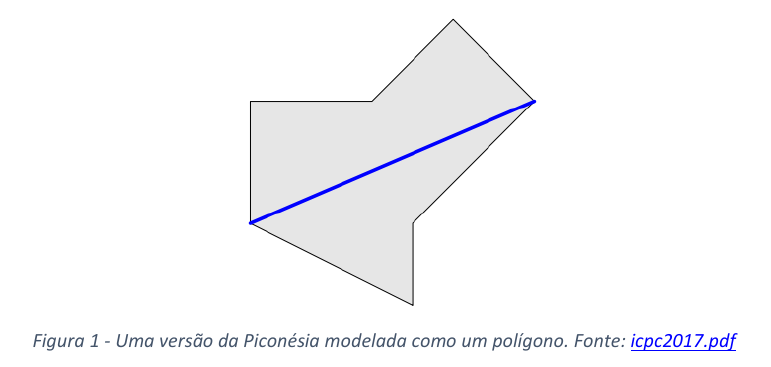

# Pontifícia Universidade Católica do Paraná Maratona de Programação 2022

Este repositório é dedicado para arquivos referentes ao treinamento e desafios de teste para a maratona de programação 2022 ICPC.

## Regras

Estas regras foram definidas em 2019 e se aplicaram a última edição. Pode haver alguma
modificação, mas caso estas modificações existam não devem ser muito grandes.

**Os times são formados por um coach e três alunos regularmente matriculados desta instituição.** 
Uma mesma instituição pode ter vários times participantes da primeira fase do
concurso. Todos os times de uma institutição devem disputar a primeira fase em uma mesma
sede. A aceitação de mais de dois times de uma escola está sujeita à capacidade da sede em que
a inscrição se realiza e será atendida por ordem de chegada.

**O coach será o representante do time junto à organização do concurso e deverá ser um docente desta escola** 
ou poderá ser indicado (através deste formulário) para a função por um
representante desta escola. O mesmo coach poderá representar vários times da escola. Uma
mesma escola pode ter vários coaches. Os times da escola deverão ser inscritos na sede da
primeira fase definida para sua região geográfica pelo Comitê Diretor do concurso. O coach
poderá solicitar uma mudança de sede ao comitê diretor. Todos os times da escola devem
competir na mesma sede.

**Cada time é composto por três alunos e, no máximo, um reserva.** Todos devem ser alunos
regulares de cursos de graduação ou pós-graduação da escola. A participação do reserva no
concurso se dará apenas em caso de algum problema ocorrer com um dos participantes antes
da realização do concurso, e a **substituição deverá ser comunicada ao Comitê Diretor da Maratona de Programação até, no máximo, a véspera da competição. Depois de iniciado o concurso não há possibilidade de substituições no time.** 
Um time com dois ou menos
componentes não poderá se qualificar às fases posteriores da Maratona de Programação. Assim,
se algo ocorrer com um dos três componentes de um time sem reserva, este time fica
desqualificado.

Cada membro, antes desta competição, **pode ter participado de no máximo uma final mundial do ICPC, de no máximo 4 (quatro) regionais sul-americanas do concurso**
 (ou seja, da Maratona de Programação) e deve ter iniciado seus estudos universitários no ano de 2015 ou anos
posteriores (a contar do início do primeiro curso universitário do aluno, mesmo que não tenha
completado este curso), ou ter nascido em 1996 ou anos posteriores.

**Em cada uma das fases da Maratona de Programação os times receberão uma prova com diversos problemas que devem ser resolvidos durante 5 horas de competição.** 
A prova da final brasileira será escrita em inglês. A prova da primeira fase poderá ser em português. Os
problemas deverão ser resolvidos em alguma das linguagens de programação disponíveis. Na
final brasileira os programas deverão ser feitos em **C, C++, python, Java ou kotlin.**

A Maratona de Programação da SBC oferece medalhas aos dez primeiros colocados na fase final
da competição: ouro para os três primeiros; prata para o quarto, quinto e sexto; e bronze para
o sétimo a décimo lugares. Além disso, o time campeão recebe uma cópia do troféu "Maratona
de Programação".

O time campeão da Maratona de Programação garante vaga nas finais mundiais do concurso de
programação do ICPC. Caso o Brasil receba outras vagas nas finais da competição, estas serão
ocupadas pelos primeiros colocados da final brasileira, respeitado o limite de uma vaga por
escola, conforme regra do ICPC.

Não será permitido o uso de dispositivos eletrônicos (celulares, relógios, calculadoras ou
computadores) durante as finais, ou eliminatórias. Nem consulta a qualquer material online.

## Ambiente de Desenvolvimento

Ubuntu 18.04 Linux(x64-bit) - com pacotes Maratona-Linux

Desktop: Gnome 3

### Editores:

* vim
* gvim
* emacs
* gedit
* geany
* kate
* codeblocks
* sublime
* VSCode

### Linguagens

* C: gcc (Ubuntu 7.3.0-12ubuntu1) 7.3.0 (c11)
* C++: g++(Ubuntu 7.3.0-12ubuntu1) 7.3.0 (C++17)
* Python 2: Python 2.7.14+
* Python 3: Python3.6.5
* Java:
  * OpenJDK version 1.8.0_162
  * OpenJDK Runtime Environment (build 1.8.0_162-8u162-b12-1-b12)
  * OpenJDK 64-Bit Server VM (build 25.162-b12, mixed mode)
* Kotlin: Kotlin version 1.3.30

### IDEs

* Java: 
  * Eclipse 3.8.1
  * IntelliJ Idea Community - 2019.1
* Python: PyCharm Community - 2019.1

---

## Desafios

### Problema 1 - O jogo da reprovação

Este problema foi adaptado de: [SPOJ.com - Problema PLACAR](https://br.spoj.com/problems/PLACAR/)


Prof. Kirk está muito preocupado com a queda do nível de atenção de seus estudantes. Tentou,
criativo com é todas as técnicas pedagógicas conhecidas para resolver este problema sem
sucesso. Aluno é bicho complicado.

Como última esperança o prof. Kirk resolveu fazer uma competição entre os alunos. Com uma
condição crítica, o último colocado será sumariamente reprovado. Ficar em último não é uma
opção. A competição consistiu em 10 problemas de computação que deveriam ser resolvidos no
prazo de 30 dias. No prazo todos os alunos enviaram seus trabalhos.

A classificação seria realizada de acordo com o número de problemas corretamente resolvidos
e os alunos seriam ordenados do maior para o menor. Em caso de empate estes seriam
resolvidos de acordo com a ordem alfabética dos nomes. Nesta turma não existem homônimos.
Esta condição fez com que alunos com nomes iniciados nas últimas letras do alfabeto se
esforçassem muito nas tarefas, e não compartilhassem suas soluções. Sua tarefa neste
problema é escrever um programa que lê os resultados dos alunos do Prof. Kirk e imprime o
nome do aluno reprovado.

#### Entrada

A entrada será composta por um conjunto de textos, um para cada instância da competição. A
primeira linha de cada instância consiste em um inteiro $n (1 <= n <= 100)$ indicando o número
de alunos naquela instância. Cada uma das $n$ linhas seguintes contém o nome do aluno e o
número de problemas corretamente resolvidos por ele. O nome consiste em uma sequência de
letras e espaços $[a-zA-Z\\s]$ com no máximo 30 símbolos. A entrada termina com final de arquivo.

Exemplo:

```text
4
Frank de Alcantara 9
Paulo Azambuja da Silva 10
Marcela Aristides 2
Marcela da Silva 2
```

#### Saída

Para cada instância, você deverá imprimir um identificador Instancia k, onde k é o número da
instância atual. Na linha seguinte imprima o nome do infeliz reprovado. Após cada instância
imprima uma linha em branco.

Exemplo:

```
Instância 1
Marcela da Silva
```

### Problema 2 - Onde construir um aeroporto

Este problema foi adaptado de: [icpc2017.pdf]("https://icpc.global/worldfinals/problems/2017 ACM-ICPC World Finals/icpc2017.pdf")

A nação tropical da Piconésia é famosa por suas belas praias, vegetação luxuriante, café e
chocolate e, principalmente pelo clima magnifico. Este paraíso está sendo considerado como
sede da Final Mundial da Maratona de Programação (ou talvez apenas como destino de férias
para o Comitê Gestor). Neste paraíso existe apenas um pequeno problema, chegar a ilha é muito
difícil.

Atualmente a forma mais rápida de se chegar a Piconésia toma três dias e exige a combinação
de meios de transporte que podem incluir, barcos de pesca, kayakes e submarinos restaurados
da Segunda Grande Guerra. O Ministério da Cultura e Turismo da Piconésia, para permitir
execução de eventos e alavancar o turismo está considerando a construção de um aeroporto. O
que leva a uma constatação interessante: quanto mais longa a pista, maior o avião que poderá
utilizá-la. O que quer dizer que a Piconésia deseja construir a pista mais longa possível. Mas,
infelizmente, seus engenheiros não foram capazes de resolver este problema. Cabe a você
ajudar, ou o Comitê Gestor não poderá passar as férias na Piconésia. Digo, a Final da Maratona
de Programação não poderá ser realizada na Piconésia.

Para este problema, vamos modelar as fronteiras da Piconésia como um polígono e, dado este
polígono, você precisará computar a mais longa pista de pouso possível dentro do território
dado. A pista de pouso não pode cruzar o oceano e não pode ter curvas, ou desvios. Mas, pode
tocar as fronteiras da nação e mesmo correr ao longo destas fronteiras. Um exemplo pode ser
visto na Figura 1.



#### Entrada

A entrada começa com uma linha contendo um inteiro n, (3 ≤ n ≤ 200) que especifica o
número de vértices do polígono que representa a Piconésia. Esta linha será seguida por n linhas
cada uma contendo dos inteiros x, y (|x|, |y| ≤ 106) que indicam as coordenadas (x, y) dos
vértices do polígono em sentido contrário ao dos ponteiros de um relógio. O polígono é simples,
o que quer dizer que seus vértices são distintos e nenhuma das arestas do polígono intercepta
ou toca outra aresta exceto nos vértices em comum entre arestas. Adicionalmente é fácil
perceber que, neste caso, duas arestas consecutivas são colineares.

Exemplo:

```
7
0 20
40 0
40 20
70 50
50 70
30 50
0 50
```

#### Saída

Mostrar o maior seguimento de reta possível que cabe dentro do polígono dado com erro
absoluto, ou relativo de no máximo 10−6.

Exemplo:

`76.157731059`

| Entrada | Saída |
| --- | --- |
| 3 <br> 0 2017 <br> -2017 -2017 <br> 2017 0 | 4510.149110617 |

### Problema 3 - Fatores Primos

Este problema foi adaptado de: [SPOJ.com - Problem CFATORES](https://br.spoj.com/problems/CFATORES/)

Escreva um programa que compute o número de diferentes fatores primos de um inteiro
positivo.

| Entrada | Saída |
| --- | --- |
| 289384 | 289384:3 |
| 930887 | 930887:2 |
| 692778 | 692778:5 |
| 636916 | 636916:4 |
| 747794 | 747794:3 |


#### Entrada

A entrada consistirá em uma série de inteiros positivos. Cada linha possui somente um número.
O valor máximo de um número é 1000000. A entrada termina em uma linha contendo o inteiro
zero e este zero não deve ser considerado como parte do conjunto de teste.

#### Saída

O programa deve imprimir cada resultado em uma linha diferente, seguindo o formado dado no
exemplo de saída apresentado a seguir:
